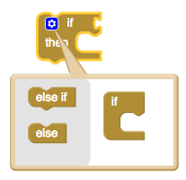
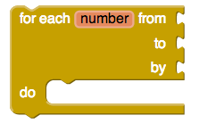

# Control

* [Place conditions on when things happen](control.md#placing-conditions-on-when-things-happen)
* [Repeat a certain event](control.md#repeat-a-certain-event)
* [Just do it](control.md#just-do-it)
* [Navigate between screens](control.md#navigate-between-screens)

### Place conditions on when things happen

\(a\)  \(b\) \(c\) 

\(a\) **If condition is true, starts event** Tests a given condition. `If` the condition is true, performs the actions in a given sequence of blocks; otherwise, the blocks are ignored

\(b\) **If condition is true, starts one event, another if false** Tests a given condition.`If` the result is true, performs the actions in the `-do` sequence of blocks; otherwise, performs the actions in the `-else` sequence of blocks

\(c\) **If first condition is true, starts one event, if second condition is true, starts second event, third if both are false** Tests a given condition. `If` the result is true, performs the actions in the `-do` sequence of blocks; otherwise tests the statement in the `-else if` section. If the result is true, performs the actions in the `-do` sequence of blocks; otherwise, performs the actions in the -else sequence of blocks

### Repeat a certain event

\(a\)  \(b\)  \(c\) 

\(a\) **Repeats event for all items in a list** Runs the blocks in the do section for each `item` in the list. Use the given variable name, item, to refer to the current list item. You can change the name item to something else if you wish

\(b\) **Repeats an event for a certain number of times** Runs the blocks in the do section for each numeric value in the range starting at from and ending at to, incrementing number by the value of by each time. Use the given variable name, number to refer to the current value. You can change the name number to something else if you wish

\(c\) **Stops repeating event if certain condition is true** Tests the `-test` condition. If true, performs the action given in `-do` , then tests again. When test is false, the block ends and the action given in -do is no longer performed

### Just do it

\(a\) \(b\) 

\(a\) **Just do it** Sometimes in a procedure or another block of code, you may need to do something and return something, but for various reasons you may choose to use this block instead of creating a new procedure

\(b\) **Dummy socket when blocks don't fit** Provides a "dummy socket" for fitting a block that has a plug on its left into a place where there is no socket, such as one of the sequence of blocks in the do part of a procedure or an if block. The block you fit in will be run, but its returned result will be ignored. This can be useful if you define a procedure that returns a result, but want to call it in a context that does not accept a result

### Navigate between screens

\(a\) \(b\)  \(c\) 

\(a\) **Opens the screen** with the provided name

\(b\) **Close the current screen**

\(c\) **Close the app**

