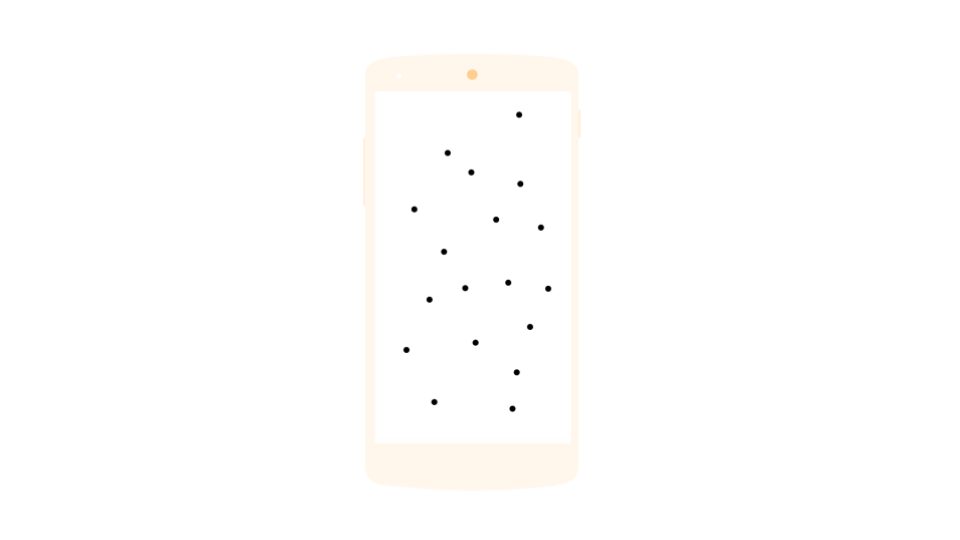
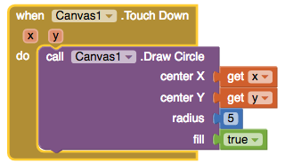
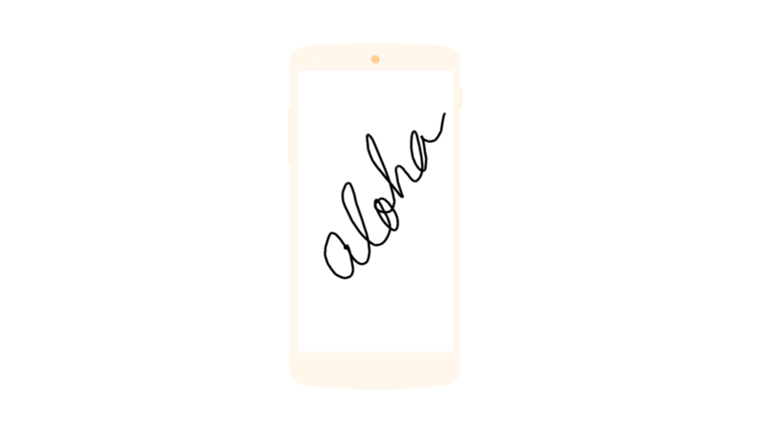
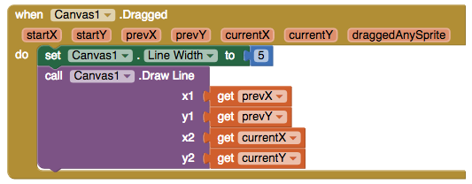
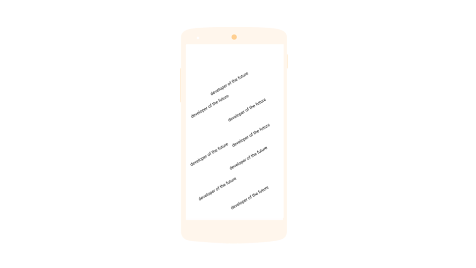
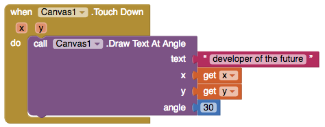
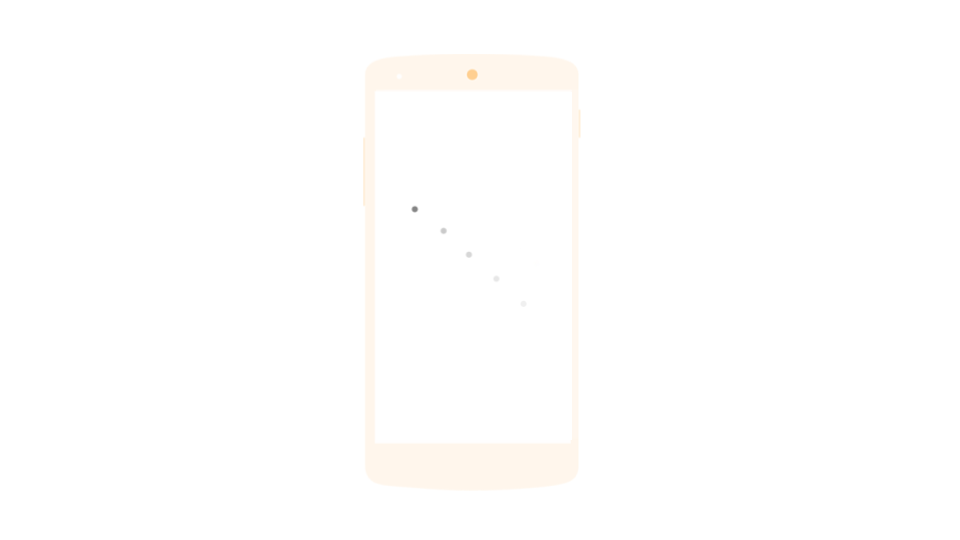
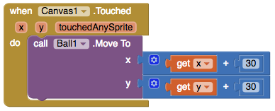
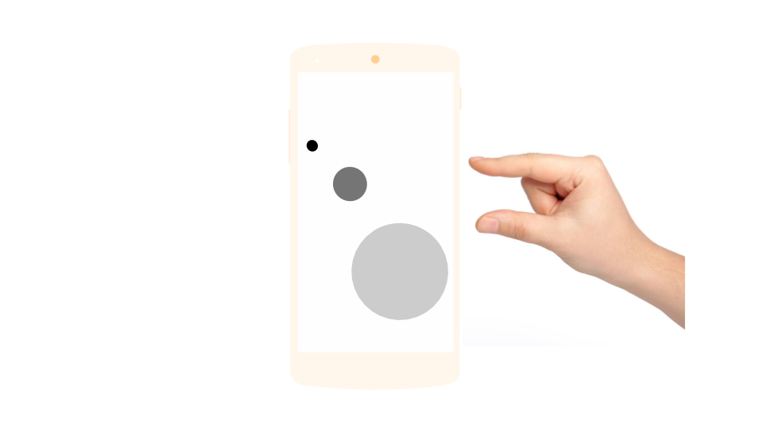
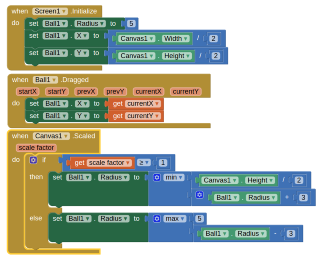

# Canvas

###  

The sample app [Inside 2016: Latest Trends in India](https://www.gitbook.com/book/albertching/thunkable-docs/edit#) uses a Canvas a backdrop to an interactive game

* [Style Canvas Background](canvas.md#style-canvas-background)
* [Draw Dots](canvas.md#draw-dots)
  * Add a circle with each touch of the canvas
* [Draw Lines](canvas.md#draw-lines)
  * Draw a line of width 5 on the canvas
* [Draw Text](canvas.md#draw-text)
  * Add text "developer of the future" angled at 30 degrees with each touch of the canvas
* [Interact with Balls or Image Sprites](canvas.md#interact-sprites)
  * Move a ball right and down 30 pixels every time it is touched
* [Easy Pong App with pinch to scale](canvas.md#easy-pong)
* [Pinch to Scale Balls or Image Sprites](canvas.md#pinch-scale) 
  * Scale a ball up or down by pinching on the Canvas

### Style Canvas Background

| Property | Description |
| :--- | :--- |
| Height | Height in pixels, percent, 'Automatic' or 'Fill' |
| Width | Width in pixels, percent, 'Automatic' or 'Fill' |
| Background Color | The background of the canvas. Default \(White\). You can choose any color on the Designer palette or customize the color to any RGB value in the Blocks editor |
| Background Image | You can upload an image to your app or reference an image url. If an image is uploaded, it will negate the background color property |
| Text Alignment | Left, center or right |
| Font Size | Point size for text drawn on the Canvas |
| Font Typeface | Default \(Roboto\), Roboto Regular, Roboto Thin, Sans Serif, Serif, and Monospace. You can upload your own custom font \(.ttf\) |
| Visible | If checked, the Canvas will be visible on the screen |

### Draw DotsAdd a circle with each touch of the Canvas {#draw-dots}

| Property | Description |
| :--- | :--- |
| Paint Color | The color in which the dots or circle are drawn. Default \(Black\). You can choose any color on the Designer palette or customize the color to any RGB value in the Blocks editor |
| Touch Down \(x, y\) | When the user begins touching the canvas \(places finger on canvas and leaves it there\). The \(x,y\) position of the touch, is relative to the upper left of the canvas |
| Touch Up \(x, y\) | When the user stops touching the canvas \(lifts finger after a TouchDown event\). The \(x,y\) position of the touch, is relative to the upper left of the canvas |
| Draw Circle \(center X, center Y, radius, fill\) | Draws a circle at the given coordinates on the canvas, with the given radius. If 'fill' is set to 'true', the circle will be filled |
| Draw Point \(x, y\) | Draws a point at the given coordinates on the canvas |
| Save | Saves a picture of this Canvas to the device's external storage. If an error occurs, the Screen's ErrorOccurred event will be called |
| Save As \(fileName\) | Saves a picture of this Canvas to the device's external storage in the file named fileName. fileName must end with one of .jpg, .jpeg, or .png |
| Clear | Clears the canvas of anything drawn |

### Draw LinesDraw a line of width 5 on the Canvas {#draw-lines}

| Property | Description |
| :--- | :--- |
| Paint Color | The color in which lines are drawn. Default \(Black\). You can choose any color on the Designer palette or customize the color to any RGB value in the Blocks editor |
| Line Width | The width of the lines drawn on the canvas |
| Dragged \(startX, startY, prevX, prevY, currentX, currentY, draggedSprite\) | When the user does a drag from one point \(prevX, prevY\) to another \(x, y\). The pair \(startX, startY\) indicates where the user first touched the screen, and "draggedSprite" indicates whether a sprite is being dragged |
| Save | Saves a picture of this Canvas to the device's external storage. If an error occurs, the Screen's ErrorOccurred event will be called |
| Save As \(fileName\) | Saves a picture of this Canvas to the device's external storage in the file named fileName. fileName must end with one of .jpg, .jpeg, or .png |
| Clear | Clears the canvas of anything drawn |

### Draw TextAdd text "developer of the future" angled at 30 degrees with each touch of the canvas {#draw-text}

| Property | Description |
| :--- | :--- |
| Paint Color | The color in which the text is added. Default \(Black\). You can choose any color on the Designer palette or customize the color to any RGB value in the Blocks editor |
| Font Size | Point size for text drawn on the canvas |
| Text Alignment | 'Center', 'left' or 'right.' Determines the alignment of the text drawn by DrawText\(\) or DrawAngle\(\) |
| DrawText\(text, x, y\) | Draws the specified text relative to the specified coordinates using the values of the FontSize and TextAlignment properties |
| Draw Text At Angle \(text, x, y,  angle\) | Draws the specified text starting at the specified coordinates at the specified angle using the values of the FontSize and TextAlignment properties |
| Save | Saves a picture of this Canvas to the device's external storage. If an error occurs, the Screen's ErrorOccurred event will be called |
| SaveAs \(fileName\) | Saves a picture of this Canvas to the device's external storage in the file named fileName. fileName must end with one of .jpg, .jpeg, or .png |
| Clear | Clears the canvas of anything drawn |

### Interacting with Balls or Image SpritesMove a ball right and down 30 pixels every time it is touched {#interact-sprites}

| Events | Description |
| :--- | :--- |
| Touched \(x, y, touchedSprite\) | When the user touches the canvas and then immediately lifts finger. The \(x,y\) position of the touch is relative to the upper left of the canvas. TouchedSprite is true if the same touch also touched a sprite |
| Flung \(x, y, speed, heading, xvel, yvel, flungSprite\) | When a fling gesture \(quick swipe\) is made on the canvas: provides the \(x,y\) position of the start of the fling, relative to the upper left of the canvas. Also provides the speed \(pixels per millisecond\) and heading \(0-360 degrees\) of the fling, as well as the x velocity and y velocity components of the fling's vector. The value "flungSprite" is true if a sprite was located near the the starting point of the fling gesture |
| Dragged \(startX, startY, prevX, prevY, currentX, currentY, draggedSprite\) | When the user does a drag from one point \(prevX, prevY\) to another \(x, y\). The pair \(startX, startY\) indicates where the user first touched the screen, and "draggedSprite" indicates whether a sprite is being dragged |

### Easy Pong App with pinch to scale {#easy-pong}

[Download source code here](https://goo.gl/LQs4su)

### Pinch to Scale {#pinch-scale}

### Scale a ball up or down by pinching on the Canvas

| Event | Description |
| :--- | :--- |
| Scaled \(scale factor\) | When the user pinches open \(or close\) on a selected Canvas item \(ball, image sprite\), the item scales by the scale factor. The scale factor increases as the pinch opens and decreases as the pinch narrows. |

