# Google Maps

####  


Only one Google Maps component can work per screen


* [Auto-centering map on user's location](google-maps.md#map-autocenter)
* [Styling your map](google-maps.md#styling-the-map)
* [Adding standard and custom markers, circles & polylines to your map](google-maps.md#add-everything)
* [Real-time location sharing with Firebase](google-maps.md#real-time-location-sharing-with-firebase)
* [Mapping geo-located assets with Spreadsheets powered by Cloudstitch](google-maps.md#mapping-geo-located-assets-with-spreadsheets-powered-by-cloudstitch)

### Auto-centering map on user's location {#map-autocenter}

Centers map on user location as depicted by blue dot

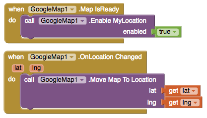

| Event | Description |
| :--- | :--- |
| Map IsReady | When Google Map loads. Please use this to load all map settings instead of Screen.Initialize |
| Enable MyLocation | If 'true', displays user location as a blue dot |
| OnLocation Changed | When Google Map senses a location change. The Google Maps location sensor is highly sensitive even when the user is stationary so this event is useful for initially centering the map on the user's location |
| Move Map To Location | Centers map to a specific latitude and longitude |

### Styling the map

The map itself can be styled in a million different ways and the markers you add to the map can be customized in a number of ways.

| Property / Event | Description |
| :--- | :--- |
| Height | Height in pixels, percent, 'Automatic' or 'Fill' |
| Width | Width in pixels, percent, 'Automatic' or 'Fill' |
| Zoom Level | 1 to 20 where 1 is most zoomed out.  We recommend zoom levels between 13 and 16 |
| Angle \(degrees\) | Tilt of the map from 0 to 90 degrees. We recommend tilts of 45 to 75 degrees and a Zoom Level of 16 for more immersive apps |
| Rotation \(degrees\) | Orientation of the map from 0 to 360 degrees. A rotation of 90 degrees rotates the map 90 degrees counterclockwise. We recommend keeping rotation at 0 except for specific circumstances |
| MapType\* | 'normal', 'terrain', 'satellite' or 'hybrid'. 'Normal' maps can be further customized with the Themes and Style \(json\) options below |
| Theme | 'standard' \(default\), 'silver', 'retro', 'dark', 'night' & 'aubergine'. MapType must be set to 'normal' \(default\) for themes to be enabled |
| Style \(json\)\* | Map style can be customized using a [Styling Wizard](https://mapstyle.withgoogle.com/) and importing the style JSON \(see example below\) |
| Enable Compass\* | If 'true', adds a compass to the map |
| Enable Rotate\* | If 'true', allows user to rotate the map |
| Enable Scroll\* | If 'true', allows user to scroll up and down the map |
| Enable ZoomControl\* | If 'true', displays '+' and '-' buttons for changing zoom level on the map |

\*Can only be set in the Blocks

#### **MapType**

Sets up map with a 'normal' MapType

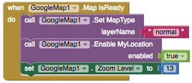

| 'normal' | 'terrain' | 'satellite' | 'hybrid' |
| :--- | :--- | :--- | :--- |
|  | 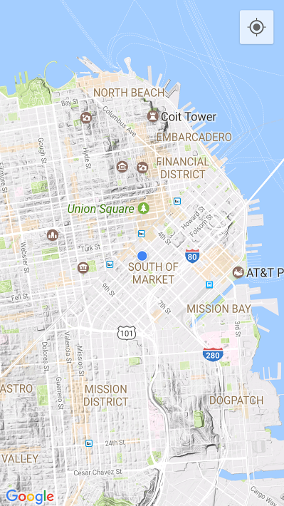 | 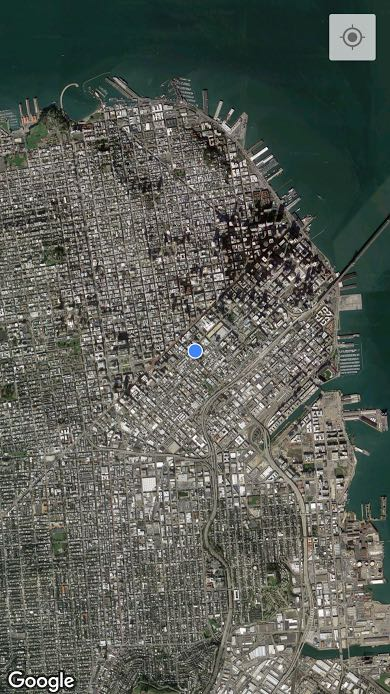 | 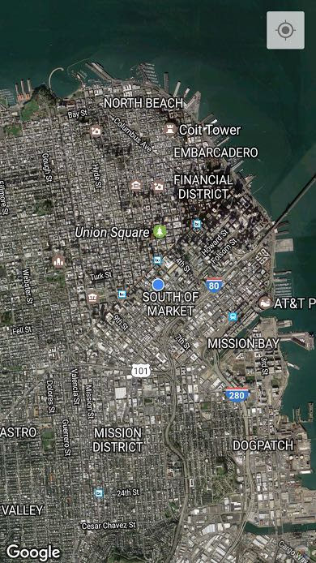 |

#### **Themes**

| 'standard' | 'silver' | 'retro' | 'dark' | 'night' | 'aubergine' |
| :--- | :--- | :--- | :--- | :--- | :--- |
| 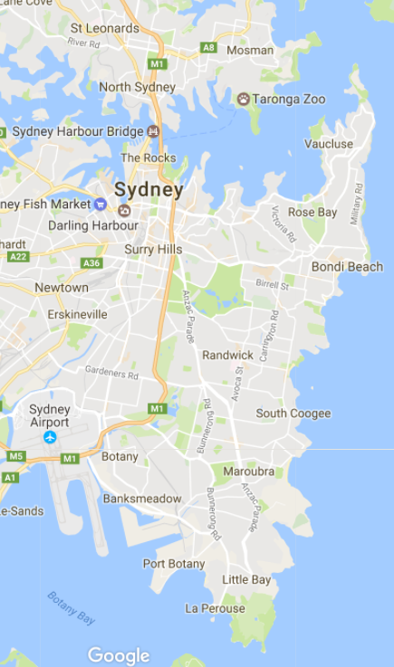 | 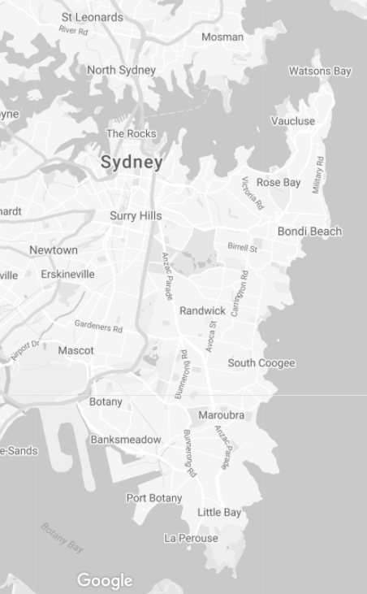 | 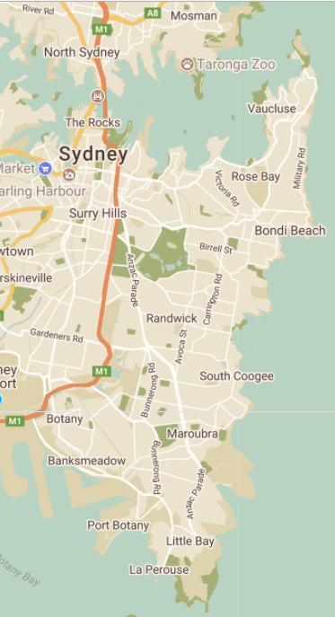 | 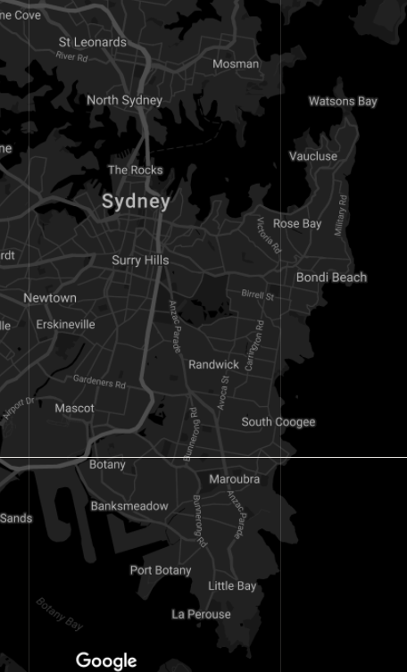 | 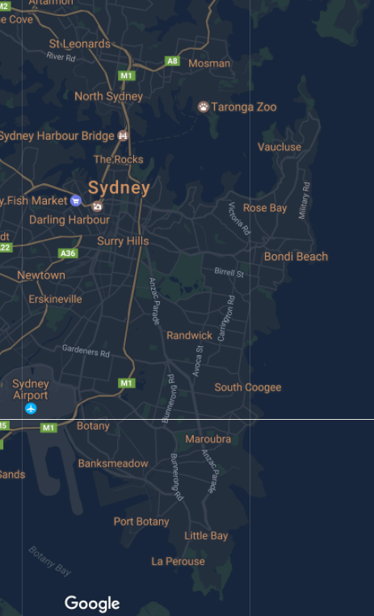 | 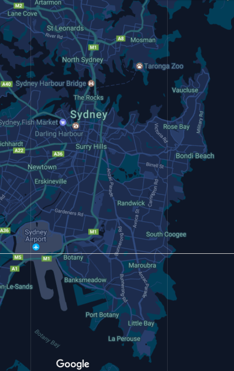 |

#### **Style \(json\)**

Google Maps lets users customize a map down to the color of the roads and the lakes. You can use a [Styling Wizard](https://mapstyle.withgoogle.com/) to create a custom style JSON file that you can import to your map.

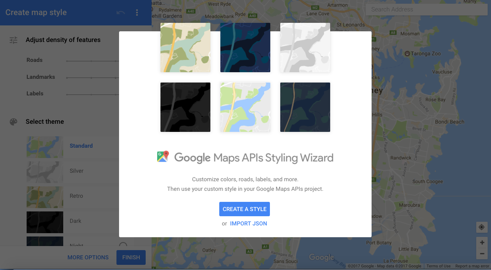

Sets up map with a custom 'white' and 'gray' style

`[ { "elementType": "geometry", "stylers": [ { "color": "#f5f5f5" } ] }, { "elementType": "geometry.fill", "stylers": [ { "color": "#ffffff" } ] }, { "elementType": "labels.icon", "stylers": [ { "visibility": "off" } ] }, { "elementType": "labels.text.fill", "stylers": [ { "color": "#000000" } ] }, { "featureType": "administrative.land_parcel", "elementType": "labels.text.fill", "stylers": [ { "color": "#bdbdbd" } ] }, { "featureType": "poi", "elementType": "geometry", "stylers": [ { "color": "#eeeeee" } ] }, { "featureType": "poi", "elementType": "labels.text.fill", "stylers": [ { "color": "#757575" } ] }, { "featureType": "poi.park", "elementType": "geometry", "stylers": [ { "color": "#e5e5e5" } ] }, { "featureType": "poi.park", "elementType": "labels.text.fill", "stylers": [ { "color": "#9e9e9e" } ] }, { "featureType": "road", "elementType": "geometry", "stylers": [ { "color": "#ffffff" } ] }, { "featureType": "road", "elementType": "geometry.fill", "stylers": [ { "color": "#d8d8d8" } ] }, { "featureType": "road.arterial", "elementType": "labels.text.fill", "stylers": [ { "color": "#757575" } ] }, { "featureType": "road.highway", "elementType": "geometry", "stylers": [ { "color": "#dadada" } ] }, { "featureType": "road.highway", "elementType": "labels.text.fill", "stylers": [ { "color": "#616161" } ] }, { "featureType": "road.local", "elementType": "labels.text.fill", "stylers": [ { "color": "#9e9e9e" } ] }, { "featureType": "transit.line", "elementType": "geometry", "stylers": [ { "color": "#e5e5e5" } ] }, { "featureType": "transit.station", "elementType": "geometry", "stylers": [ { "color": "#eeeeee" } ] }, { "featureType": "water", "elementType": "geometry", "stylers": [ { "color": "#e4e4e4" } ] }, { "featureType": "water", "elementType": "geometry.fill", "stylers": [ { "color": "#f3f3f3" } ] }, { "featureType": "water", "elementType": "labels.text.fill", "stylers": [ { "color": "#9e9e9e" } ] } ]`

### Adding standard markers, custom markers, circles & polylines to your map {#add-everything}

| Event | Description |
| :--- | :--- |
| Add Standard Marker \(lat, lng, color, title, snippet, draggable\) | Adds a standard marker based on specifications. Lat is latitude in decimal degrees \(between -90 and 90\), lng is longitude in decimal degrees \(between -180 and 180\), color is the color the marker, title is the headline and the snippet is the subtitle. Note: The draggable property can be set to 'true' or 'false' but it does not work on a mobile device |
| Add a Custom Marker \(lat, lng, icon, title, snippet, draggable\) | Same as standard marker except icon is replaced by color. We recommend that map icons be 48 px by 48 px |
| Add Markers From JSON \(string\) | Adds a single or multiple standard or custom markers based on a specified [JSON string format](google-maps.md#markers-json) |
| Add Circle \(lat, lng, radius, alpha, hue, strokeWidth, strokeColor, draggable\) | Same as markers except radius is the radius of the circle in meters, alpha is the opacity of the fill from 0 to 100 \(100 is fully opaque\), hue is the color of the fill, strokeWidth is the width of the circle outline in pixels, and strokeColor is the color of the circle outline |
| Add Polyline \(points, width, color\) | Adds a polyline based on specifications. Points is a string of points in lat, lng format, width is the width of the line in pixels and color is the color of the line |
| Get Points from JSON \(string\) | Use in conjunction with Add Polyline to add a polyline points in a specified [JSON string format](google-maps.md#markers-json) |
| Enable MapClickListener | if 'true', enables an event e.g. add marker when a user taps on the map |
| Enable MapLongClickListener | If 'true', enables an event when a user long presses on the map |
| On MapClick | Triggers an event e.g. add marker when a user taps on the map. Enable MapClickListener must be set to 'true' |
| On MapLongClick | Triggers an event e.g. add marker when a user long presses on the map. Enable MapLongClickListener must be set to 'true |

| Standard marker | Custom marker | Circle | Polyline |
| :--- | :--- | :--- | :--- |
| 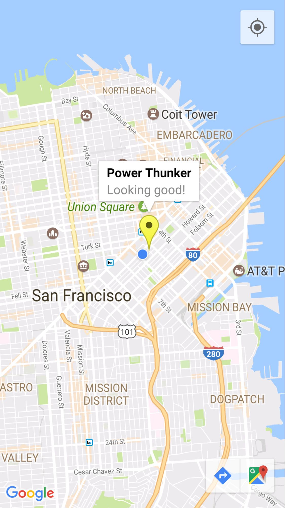 | 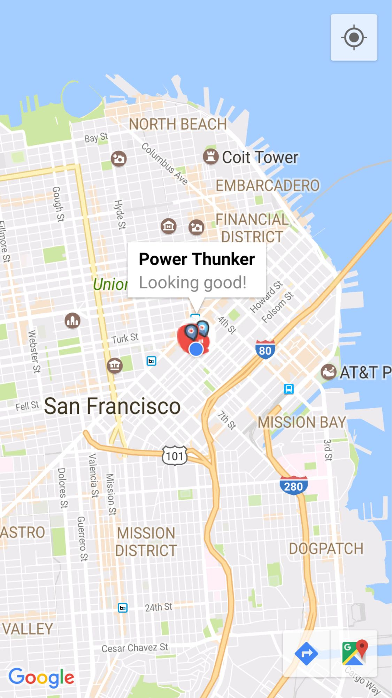 | 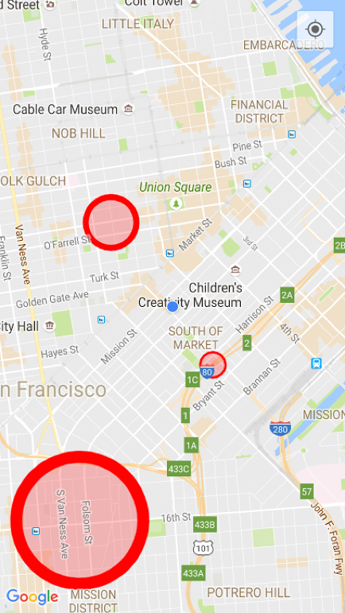 | 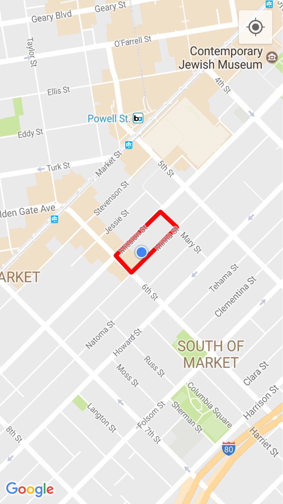 |

#### Removing Markers, Circles and Polylines before you add a new one {#markers-json}

Google maps does not remove any marker, circle or polyline you have added to your map which can quickly clutter up your map. We recommend that in many cases, you create a function for removing existing markers, circles or polylines before you add new ones like the one below:

#### **Add Standard Marker**

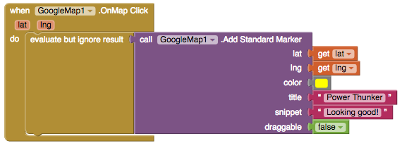

#### **Add Custom Marker**

#### Add Markers From JSON string format {#markers-json}

Standard markers

string = `[{lat: 37.77, lng: 122.42, color: 210, title: Power Thunker}, {lat: 37.78, lng: 122.58, color: 240, title: New Thunker}, {lat: 37.85, lng: 122.65, color: 240, title: Funny Thunker}]`

Custom markers

string = `[{lat: 37.77, lng: 122.42, icon: icon-thunkablemapsmall.png, title: Power Thunker}, {lat: 37.78, lng: 122.58, icon: icon-thunkablemapsmall.png, title: New Thunker}, {lat: 37.85, lng: 122.65, icon: icon-thunkablemapsmall.png, title: Funny Thunker}]`

#### Add Circle {#markers-json}

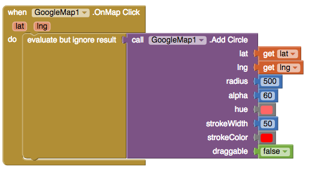

#### Add Polyline Option 1 {#markers-json}

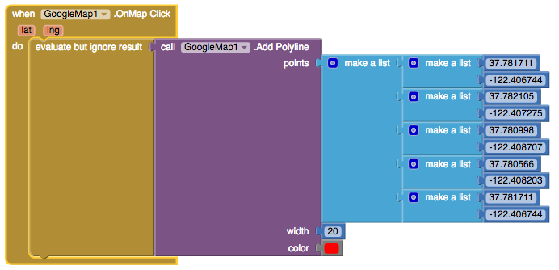

#### Add Polyline Option 2 {#markers-json}

#### Get Points from JSON string format {#markers-json}

string = `[[lat: 37.77, lng: 122.42], [lat: 37.78, lng: 122.58], . . .]`

### Real-time location sharing with Firebase

[Click here to view the source code](http://app.thunkable.com/?locale=en&repo=share.thunkableapps.com/templates/MapsDemo2.asc)

### Mapping geo-located assets with Spreadsheets powered by Cloudstitch

[Click here to view the source code](http://app.thunkable.com/?locale=en&repo=share.thunkableapps.com/templates/MapsDemo3.asc)

[Click here to view the spreadsheet](https://docs.google.com/spreadsheets/d/11D2B4-Q0zoiKnYsAThUi2ix2kbhlmDsliycJexw5fSA/edit?usp=sharing)

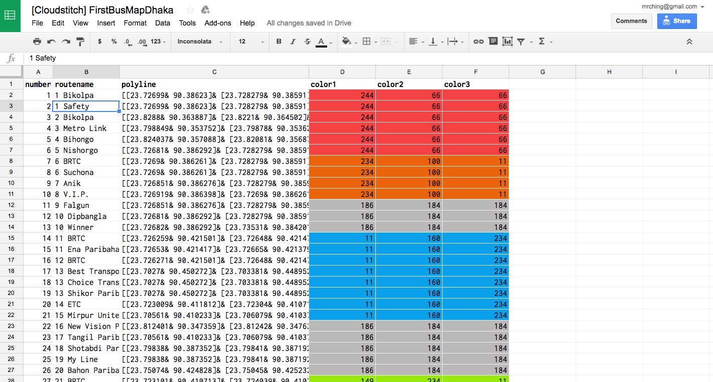

