# AdMob


Thunkable charges a maintenance fee of 5% of the ad revenue generated for use of the AdMob component. In order to use the AdMob component, users must comply with [Google Play and AdMob Policies](https://support.google.com/googleplay/android-developer/answer/113474). If you violate these policies, Thunkable may disable your apps from showing ads, or for repeated violations, disable your account entirely \(See [Thunkable's Terms of Use](https://thunkable.com/#/terms)\)


###  

We have a [section on our community forum](https://community.thunkable.com/c/professional/admob) dedicated to helping users use this component effectively.

* [Set up](admob.md#set-up)
* [Loading an Ad](admob.md#loading-an-ad)
* [Troubleshooting](admob.md#troubleshooting)

**Important: Apps that are created specifically for earning money via AdMob e.g. earning apps, auto-impression apps are in violation of Google Play and AdMob Policies.** Thunkable reserves the right to disable your apps from showing ads, or for repeated violations, disable your account entirely \(See [Thunkable's Terms of Use](https://thunkable.com/#/terms)\).


AdMob and the General Data Protection Regulation \(GDPR\). __Look for the PersonalizedAd property and blocks in the AdMob components. It is up to you, the developer, to obtain the user’s consent by displaying a screen/dialog asking the user whether they want to see personalized or non-personalized ads. You would then use that information to set the PersonalizedAd property on your ads before loading them.


In addition, we recommend that app developers audience first before implementing ads both because it takes away from the user experience. Without a sufficient audience, you won't generate much revenue anyway. Google will also refund advertisers and invalidate accidental or fraudulent clicks and even disable an ad or an account where it detects there are.

AdMob offers two types of ads:

| Interstitial | Banner |
| :--- | :--- |
| 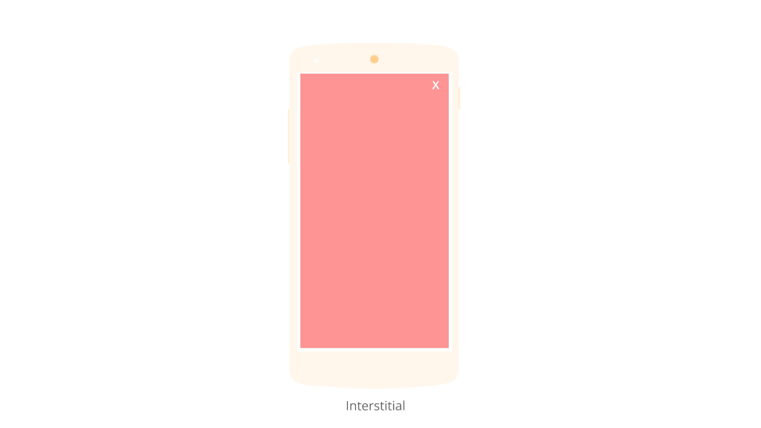 | 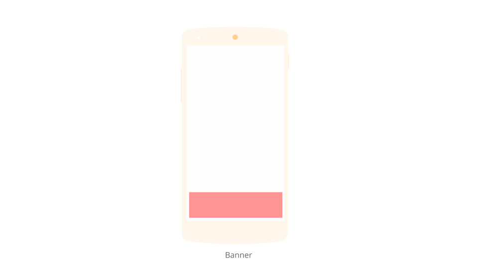 |
| Full screen | 320 x 50 fixed ratio |
| Best suited for apps with linear user experiences with clear starts and stops.  For a gaming app, a good time for an interstitial is after a level is complete.  For a non-gaming app, interstitials may be effective after a number of actions have been completed | Works well with most apps but avoid placing in the middle of screen esp in between interactive content as this may reduce the likelihood of users to engage with the ad or lead to accidental clicks |

### Set up

There is a bit of set-up required to start making money with AdMob. The step that usually confuses users is the waiting period between when an account is created and when ads are ready to go live, which sometimes may take a day.

1. [Go to AdMob](https://www.google.com/admob/) and create an account 
2. Add an existing app on Google Play or one that is not yet published 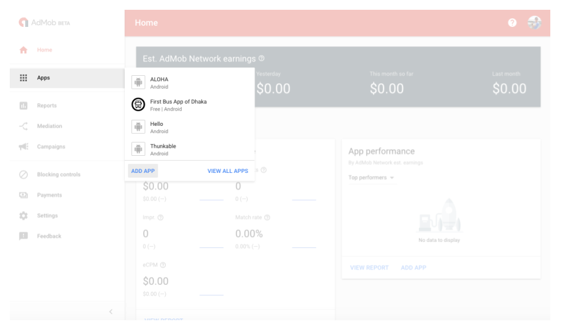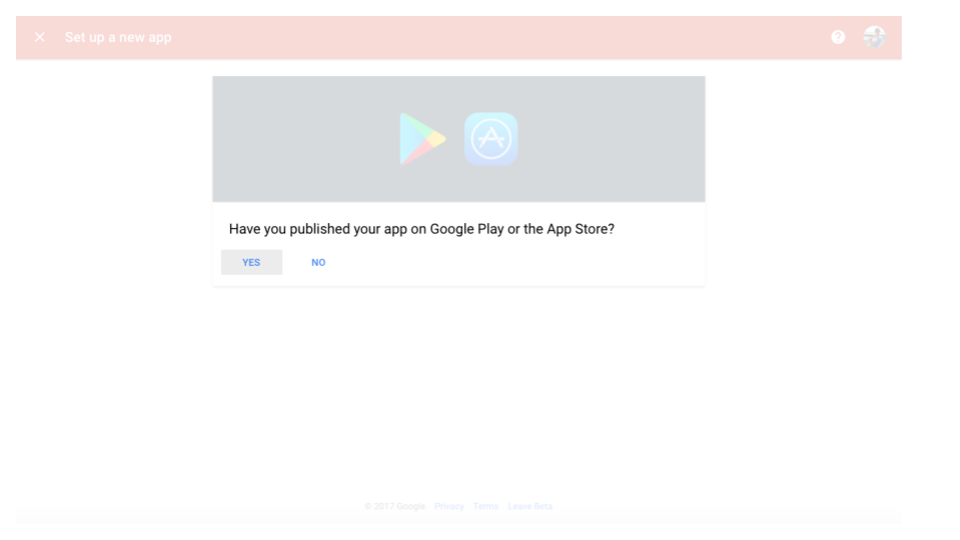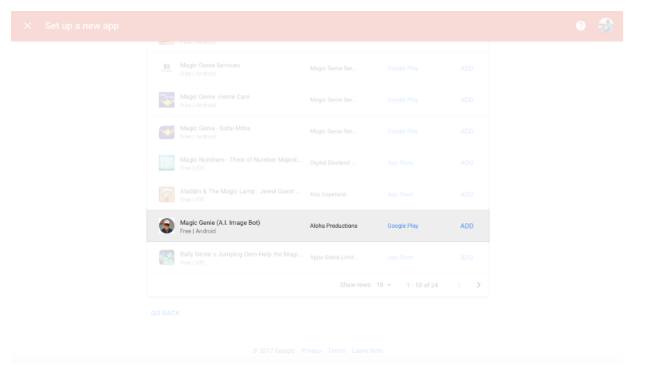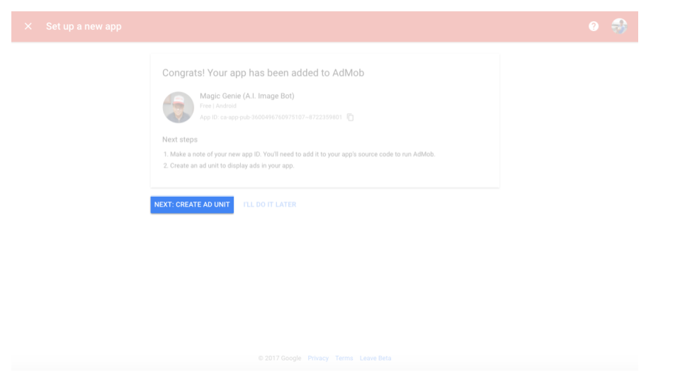
3. Create an ad unit and find your Ad Unit ID to copy into Thunkable  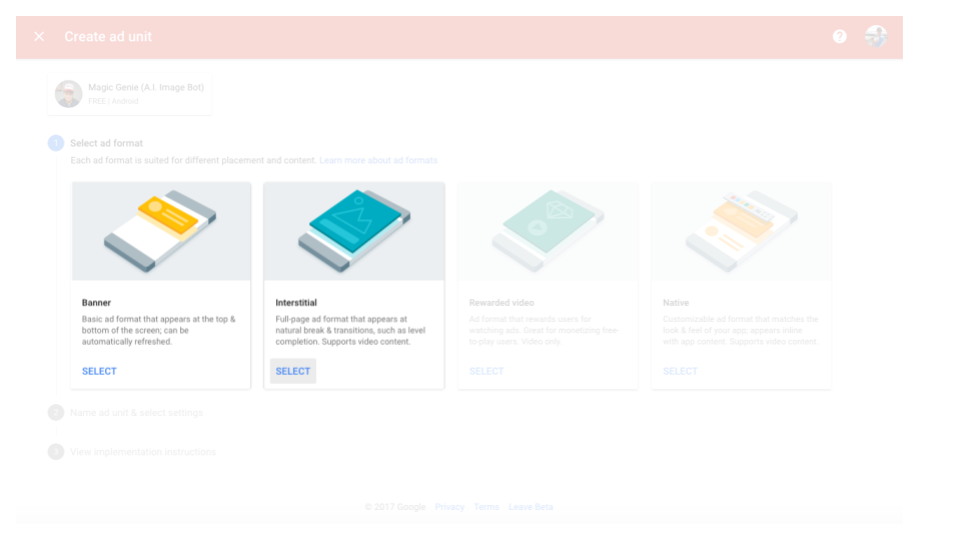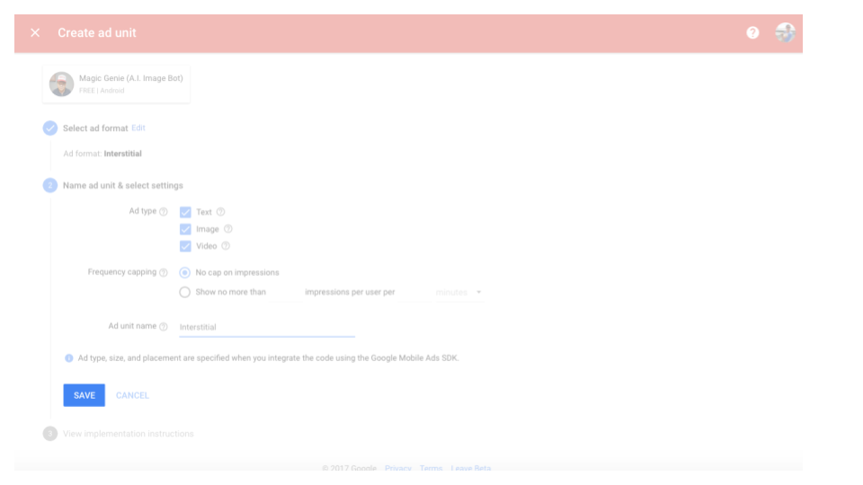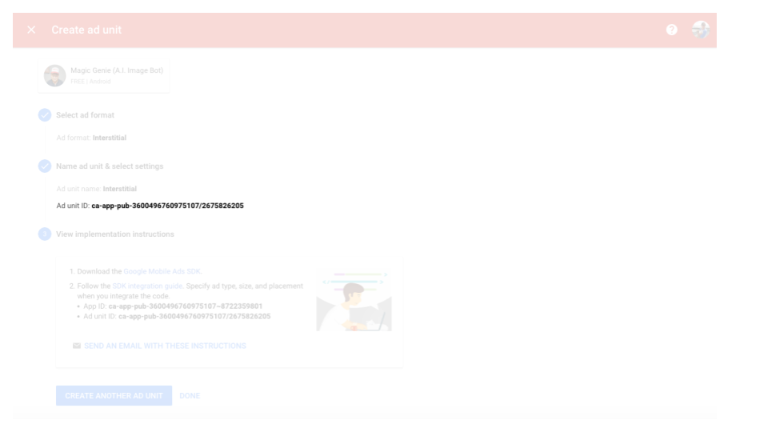
4. Set the Screen Size on Thunkable Screen1 to 'Responsive' 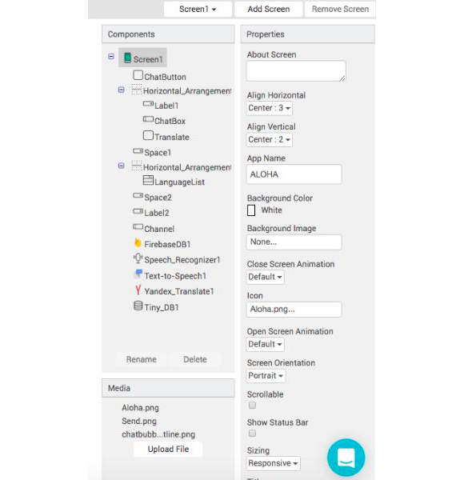

### GDPR and Non-Personalized Ads


The recent EU Protection Regulation \(GDPR\) requires developers to obtain the user's consent by displaying a screen / dialog to ask the user if they want to see personalized or non-personalized ads.


Once you have obtained consent, you can then set the property appropriately before loading your ads.

| Property | Description |
| :--- | :--- |
| Personalized Ad | If `true`, the ads will be personalized |

### Loading an Ad

Loads your AdMob banner ad after the user has been in your app for 20 seconds. You can adjust the timer to vary the time before the ad loads but it may actually be both better for the user experience and for your earnings to wait a little bit of time before you trigger the ads to prevent app users from bouncing too quickly

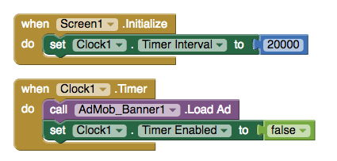

| Property / Event | Description |
| :--- | :--- |
| Ad unit ID | ID retrieved from your AdMob account \(see set-up above\) after you create a new ad unit and select ad format |
| Test mode | If 'true', ad clicks will not count. We recommend that you select 'true' when testing and then set to 'false' when you publish your app live |
| Load Ad | Loads the ad |
| Visible | If 'true', ad will be visible on the screen |

### Troubleshooting

Common issues

* Ads are not showing up
  * AdMob account created very recently. Usually it takes at least a few hours for the account to be activated
  * For Banner Ads, Screen set to 'Fixed'. Screen needs to be set to 'Responsive'
  * Load Ad block not called in Blocks Editor
  * Account has been suspended by AdMob. Clicking ads on your own app can lead to suspensions as can one or more users repeatedly clicking the ads on your app. Accounts can also be suspended for deceptive ad placement that generates accidental clicks
  * [Check the AdMob forum for more potential errors](https://community.thunkable.com/c/professional/admob)

