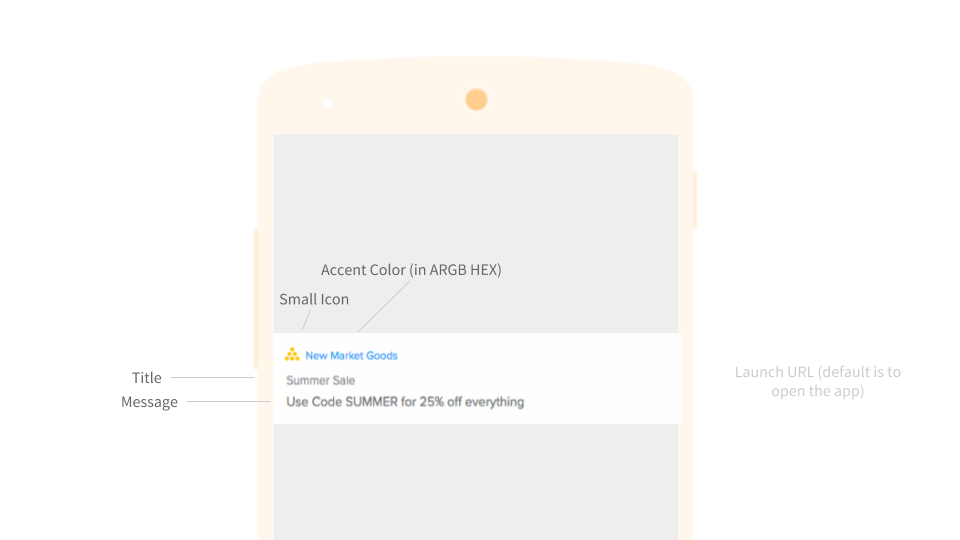
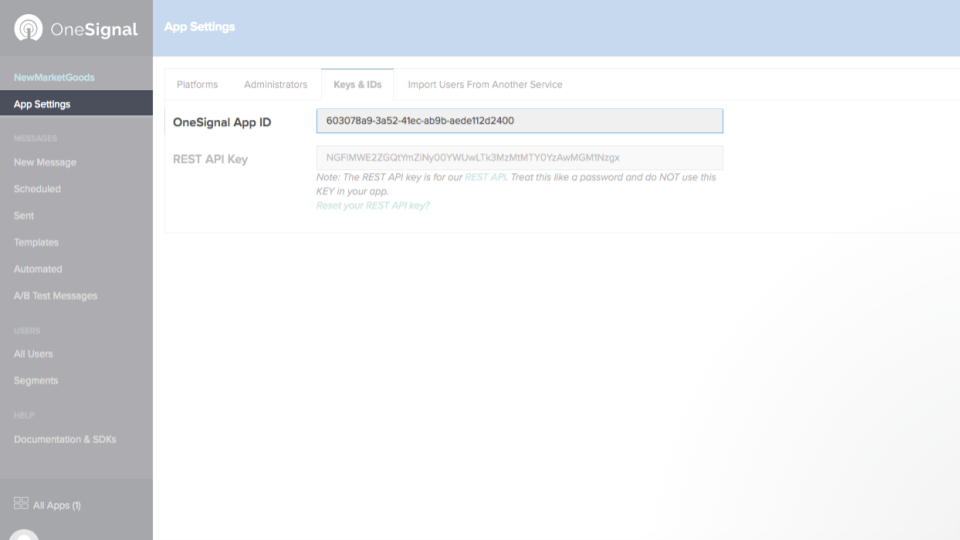
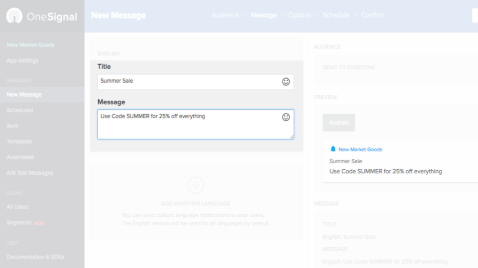
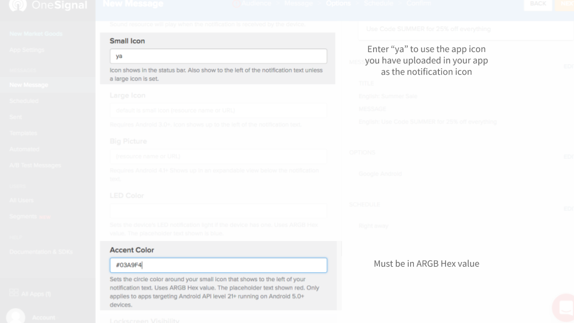
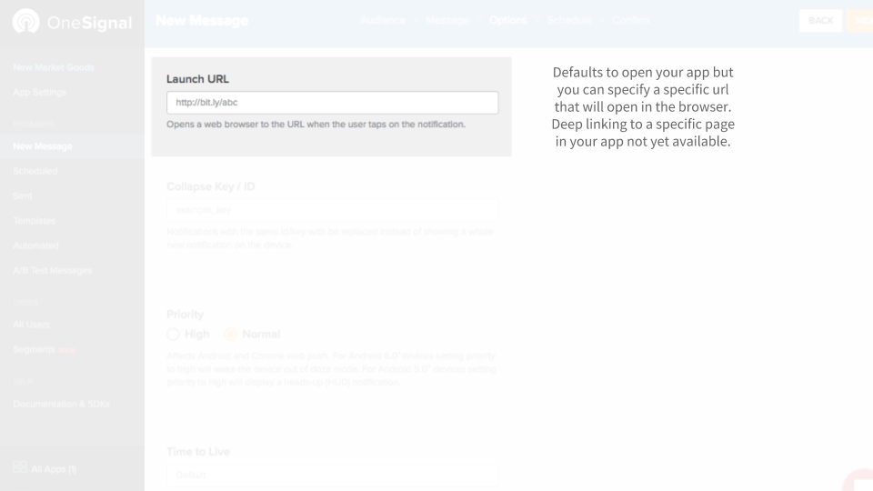
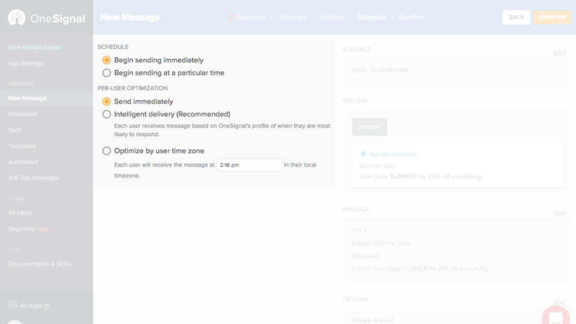

# Push Notifications

 .

However, like ads, being overly aggressive can backfire and have a negative effect on your users. Annoying notifications--those that are irrelevant and too frequent--are the number one reason why users uninstall mobile apps.

| App type | Frequency | Content |
| :--- | :--- | :--- |
| E-commerce | Sales | Coupon code |
| Game | App updates | Try this new level |

We recommend limiting push notifications to content that will be welcomed by a large majority of your users. Less is more!

Most of the work you do to use push notifications in your app will be on the One Signal interface. On Thunkable, you simply drag and drop the component in and add the One Signal API key.

* [Set up with One Signal](push-notifications.md#set-up-with-one-signal)
* [Connect One Signal with your app](push-notifications.md#connecting-one-signal-with-your-app)
* [Create a message](push-notifications.md#create-a-message)
* [Add your app icon and title accent color](push-notifications.md#add-your-app-icon-and-title-accent-color) \(optional\)
* [Specify the launch url](push-notifications.md#specify-the-launch-url-optional) \(optional\)
* [Push immediately or schedule the notification](push-notifications.md#push-the-notification)

### Set up with One Signal

One Signal is a free service that supports unlimited devices and notifications

* Go to [One Signal](https://onesignal.com/) and login
* Add a new app
* Generate a [Google Server API key](https://documentation.onesignal.com/docs/generate-a-google-server-api-key) and project number
* Select 'Native Android' as target SDK

### Connecting One Signal with your app

After dragging and dropping the Push Notifications component to your app, go to the App Settings page of your app and copy the One Signal App ID into the properties of the Push Notifications component

| Property | Description |
| :--- | :--- |
| One Signal App ID | Corresponds to the One Signal App ID on the App Settings page of One Signal |

### Create a message on One Signal

### Add your app icon and title accent color \(optional\)

If you want to use your app icon as your notification icon, you simply enter the letters "ya" into the small icon field

### Specify the launch url \(optional\)

### Push immediately or schedule the notification

One Signal allows users to send a push notification immediately or schedule one for later. You can also select their more intelligent timing that optimizes for a user's timezone or most likely to click time.

IMPORTANT: It may take a few minutes for your first push notification to go through

